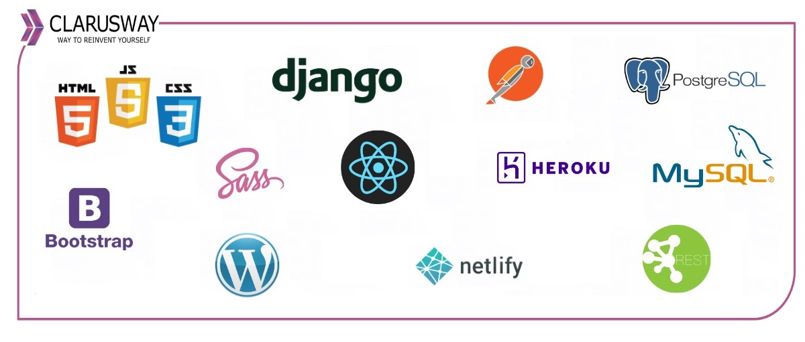

<center></center>
<br>

<center><h1> Django Class Notes</h1></center>
<p>Clarusway</p>
<br>

# Class Based Views

### Nice to have VSCode Extentions:
- Djaneiro - Django Snippets

### Needs
- Python, add the path environment variable
- pip
- virtualenv
- .gitignore file

## Summary
- Introduction to class-based views
- Spin up the project
- Secure your project
- TemplateView
  - Using TemplateView in urls.py
  - Using TemplateView in views.py
- Generic display views
  - ListView
  - DetailView
- Generic editing views
  - CreateView
  - UpdateView
  - DeleteView

## Introduction to class-based views

A view is a callable which takes a request and returns a response. This can be more than just a function, and Django provides an example of some classes which can be used as views. 

These allow you to structure your views and reuse code by harnessing inheritance and mixins. 

Class-based views provide an alternative way to implement views as Python objects instead of functions. They do not replace function-based views, but have certain differences and advantages when compared to function-based views:

- Organization of code related to specific HTTP methods (GET, POST, etc.) can be addressed by separate methods instead of conditional branching.

- Object oriented techniques such as mixins (multiple inheritance) can be used to factor code into reusable components.

## Spin up the project

- Clone the template project to your local:
```git
git clone https://github.com/bluehackrafestefano/CBViewsTemplateProject.git
```

- Use the folder created after clone as the procject main directory, cd to this new directory.

- Create virtual environment as a best practice:
```py
python3 -m venv env # for Windows or
python -m venv env # for Windows
virtualenv env # for Mac/Linux or;
virtualenv env -p python3 # for Mac/Linux
```
- Activate scripts:
```bash
.\env\Scripts\activate  # for Windows
source env/bin/activate  # for MAC/Linux
```

- See the (env) sign before your command prompt.

- Install dependencies:
```py
pip install -r requirements.txt
```

- See installed packages:
```sh
pip freeze

# you will see:
asgiref==3.5.0
Django==4.0.1
django-crispy-forms==1.14.0
Pillow==9.0.0
python-decouple==3.5
sqlparse==0.4.2
tzdata==2021.5
# If you see lots of things here, that means there is a problem with your virtual env activation; activate scripts again.
```

## Secure your project

### .gitignore

- A gitignore file is already added  to the project root directory. It is essential to use it, because you don't want to send your credentials, big folders, local db files etc. to Github.

### python-decouple

- Create .env file on root directory. We will collect our variables in this file.
```py
SECRET_KEY=o5o9...
```
- Django secret key generator websites can be used to find a secure key.

- From now on you can send you project to the github.

- Migrate:
```bash
python3 manage.py migrate  # or;
python manage.py migrate  # or;
py manage.py migrate
```

- Create superuser:
```bash
py manage.py createsuperuser  # or;
python manage.py createsuperuser  # or;
python3 manage.py createsuperuser
```

- Run the server and see the initial setup:
```bash
py manage.py runserver  # or;
python manage.py runserver  # or;
python3 manage.py runserver
```

## TemplateView

- Renders a given template, with the context containing parameters captured in the URL.

- Look at the documentation:
[TemplateView Documentation](https://docs.djangoproject.com/en/4.0/ref/class-based-views/base/#templateview)

### Using TemplateView in urls.py

- Go to fscohort/urls.py and amend lines:

```python
from django.urls import path
from .views import home,student_list, student_add, student_detail, student_update, student_delete

# Adding this line to use TemplateView:
from django.views.generic.base import TemplateView

urlpatterns = [
    # path('', home, name="home"), # comment out this line
    # rendering template in urls.py
    path('', TemplateView.as_view(template_name= "fscohort/home.html"), name="home"), # new line

    path('student_list/', student_list, name="list"),
    path('student_add/', student_add, name="add"),
    path('detail/<int:id>/', student_detail, name="detail"),
    path('update/<int:id>/', student_update, name="update"),
    path('delete/<int:id>/', student_delete, name="delete"),
]
```
- Now run the server and see home page still being rendered.

### Using TemplateView in views.py

- Go to fscohort/views.py and add below lines:
```python
from django.views.generic.base import TemplateView

class HomeView(TemplateView):
    template_name = "fscohort/home.html"

    # Override get_context_data() function to add a context:
    # def get_context_data(self, **kwargs):
    #     context = super().get_context_data(**kwargs)
    #     context['number'] = random.randrange(1, 100)
    #     return context
    # Another example:
    # def get_context_data(self, **kwargs):
    #     context = super().get_context_data(**kwargs)
    #     context['latest_articles'] = Article.objects.all()[:5]
    #     return context
```

- Go to fscohort/urls.py and amend lines

```py
from django.urls import path
from .views import home,student_list, student_add, student_detail, student_update,student_delete

# from django.views.generic import TemplateView # commented

# Import new class base view:
from .views import HomeView # new line

urlpatterns = [
    # path('', home, name="home"),
    # path('', TemplateView.as_view(template_name= "fscohort/home.html"), name="home"), # commented
    path('', HomeView.as_view(), name="home"), # new line
    path('student_list/', student_list, name="list"),
    path('student_add/', student_add, name="add"),
    path('detail/<int:id>/', student_detail, name="detail"),
    path('update/<int:id>/', student_update, name="update"),
    path('delete/<int:id>/', student_delete, name="delete"),
]
```

## Generic display views

- ListView and DetailView are two generic class-based views which designed to display data. On many projects they are typically the most commonly used views.

### ListView

- A page representing a list of objects.

- While this view is executing, self.object_list will contain the list of objects (usually, but not necessarily a queryset) that the view is operating upon.

[ListView Documentation](https://docs.djangoproject.com/en/4.0/ref/class-based-views/generic-display/#listview)

- Go to fscohort/views.py and add below lines:
```py
from django.views.generic.list import ListView

class StudentListView(ListView):
    model = Student

    # default template name : # fscohort/student_list.html
    # this fits our template name no need to use this time
    # template_name = "fscohort/student_list.html"

    context_object_name = 'students'
    # default context name : student_list
    # you can change from template. If you don't want to change, use this field

    # Optionally, pagination is possible, especially for long lists
    paginate_by = 10
```

- Go to fscohort/urls.py and amend lines:
```py
from django.urls import path
from .views import home,student_list, student_add, student_detail, student_update,student_delete
# from django.views.generic import TemplateView
from .views import HomeView, StudentListView # newly added

urlpatterns = [
    # path('', home, name="home"),
    # path('', TemplateView.as_view(template_name= "fscohort/home.html"), name="home"),
    path('', HomeView.as_view(), name="home"),
    # path('student_list/', student_list, name="list"), # commented
    path('student_list/', StudentListView.as_view(), name="list"), # new line
    path('student_add/', student_add, name="add"),
    path('detail/<int:id>/', student_detail, name="detail"),
    path('update/<int:id>/', student_update, name="update"),
    path('delete/<int:id>/', student_delete, name="delete"),
]
```

### DetailView

- While this view is executing, self.object will contain the object that the view is operating upon.

- [DetailView Documentation](https://docs.djangoproject.com/en/4.0/ref/class-based-views/generic-display/#detailview)

- Go to fscohort/views.py and add below lines

```py
from django.views.generic.detail import DetailView

class StudentDetailView(DetailView):
    model = Student

    pk_url_kwarg = 'id'
    # pk_url_kwarg: The name of the URLConf keyword argument that contains the primary key. By default, pk_url_kwarg is 'pk'.
```

- Go to fscohort/urls.py and amend lines

```py
from django.urls import path
from .views import home,student_list, student_add, student_detail, student_update,student_delete
# from django.views.generic import TemplateView
from .views import HomeView, StudentListView, StudentDetailView # newly added

urlpatterns = [
    # path('', home, name="home"),
    # path('', TemplateView.as_view(template_name= "fscohort/home.html"), name="home"),
    path('', HomeView.as_view(), name="home"),
    # path('student_list/', student_list, name="list"),
    path('student_list/', StudentListView.as_view(), name="list"),
    path('student_add/', student_add, name="add"),
    # path('detail/<int:id>/', student_detail, name="detail"), # commented
    # id must be pk or slug, so need to add a field to the view. Or we can simply change id to pk.
    path('detail/<int:id>/', StudentDetailView.as_view(), name="detail"), # new line
    path('update/<int:id>/', student_update, name="update"),
    path('delete/<int:id>/', student_delete, name="delete"),
]
```

## Generic editing views

- There are generic views for Create, Update, Delete, and Form. The following views provide a foundation for editing content.

### CreateView

- A view that displays a form for creating an object, redisplaying the form with validation errors (if there are any) and saving the object.

- [CreateView Documentation](https://docs.djangoproject.com/en/4.0/ref/class-based-views/generic-editing/#createview)

- Go to fscohort/views.py and add below lines

```py
from django.views.generic.edit import CreateView
from django.urls import reverse_lazy

class StudentCreateView(CreateView):
    model = Student

    # If form_class is provided, that class will be used. Otherwise, a ModelForm will be instantiated.
    form_class = StudentForm

    # Default is fscohort/student_form.html.
    template_name = "fscohort/student_add.html"

    # This field is to redirect:
    success_url = reverse_lazy("list")
```

- reverse_lazy() is, as the name implies, a lazy implementation of the reverse() URL resolver. Unlike the traditional reverse function, reverse_lazy() won't execute until the value is needed. It is useful because it prevent Reverse Not Found exceptions when working with URLs that may not be immediately known.

- Difference:
  - reverse() use in funcation & reverse_lazy() use in class.
  - reverse() use in string & reverse_lazy() use in object

- Go to fscohort/urls.py and amend lines

```python
from django.urls import path
from .views import home,student_list, student_add, student_detail, student_update,student_delete
# from django.views.generic import TemplateView
from .views import HomeView, StudentListView, StudentDetailView, StudentCreateView # newly added

urlpatterns = [
    # path('', home, name="home"),
    # path('', TemplateView.as_view(template_name= "fscohort/home.html"), name="home"),
    path('', HomeView.as_view(), name="home"),
    # path('student_list/', student_list, name="list"),
    path('student_list/', StudentListView.as_view(), name="list"),
    # path('student_add/', student_add, name="add"), # commented
    path('student_add/', StudentCreateView.as_view(), name="add"), # newline
    # path('detail/<int:id>/', student_detail, name="detail"),
    path('detail/<int:id>/', StudentDetailView.as_view(), name="detail"),
    path('update/<int:id>/', student_update, name="update"),
    path('delete/<int:id>/', student_delete, name="delete"),
]
```

### (Optional) How to override a field

- As an example, let's try to change form save behaviour. We want to assign a default student number if there is no.

- Dive deep into django.views.generic.edit.CreateView, find out form_valid function which is responsible to save the object if the form is valid, copy the function and add this code part:
```py
    def form_valid(self, form):
        """If the form is valid, save the associated model."""
        self.object = form.save()
        ###########################
        # Here is the code block we may add:
        if not self.object.number:
            self.object.number = 9999
        self.object.save()
        ###########################
        return super().form_valid(form)   
```

## UpdateView

- A view that displays a form for editing an existing object, redisplaying the form with validation errors (if there are any) and saving changes to the object.

- [UpdateView Documentation](https://docs.djangoproject.com/en/4.0/ref/class-based-views/generic-editing/#updateview)


- Go to fscohort/views.py and add below lines

```py
from django.views.generic.edit import UpdateView

class StudentUpdateView(UpdateView):
    model = Student

    # If form_class is provided, that class will be used. Otherwise, a ModelForm will be instantiated
    form_class = StudentForm

    # Default app/modelname_form.html
    template_name = "fscohort/student_update.html"

    success_url = '/student_list/'  # or alternative reverse_lazy("list")

    # pk_url_kwarg = 'id'
    # In this example, we decided to change the urls.py and use pk instead of id.
```

- Go to fscohort/urls.py and amend lines:
```py
from django.urls import path
from .views import home,student_list, student_add, student_detail, student_update,student_delete
# from django.views.generic import TemplateView
from .views import HomeView, StudentListView, StudentDetailView, StudentCreateView, StudentUpdateView # newly added

urlpatterns = [
    # path('', home, name="home"),
    # path('', TemplateView.as_view(template_name= "fscohort/home.html"), name="home"),
    path('', HomeView.as_view(), name="home"),
    # path('student_list/', student_list, name="list"),
    path('student_list/', StudentListView.as_view(), name="list"),
    # path('student_add/', student_add, name="add"),
    path('student_add/', StudentCreateView.as_view(), name="add"),
    # path('detail/<int:id>/', student_detail, name="detail"),
    path('detail/<int:id>/', StudentDetailView.as_view(), name="detail"),
    # path('update/<int:id>/', student_update, name="update"), # commented
    path('update/<int:pk>/', StudentUpdateView.as_view(), name="update"), # new line
    path('delete/<int:id>/', student_delete, name="delete"),
]
```

## DeleteView

- A view that displays a confirmation page and deletes an existing object. The given object will only be deleted if the request method is POST.

- [DeleteView Documentation](https://docs.djangoproject.com/en/4.0/ref/class-based-views/generic-editing/#deleteview)


- Go to fscohort/views.py and add below lines

```py
from django.views.generic.edit import DeleteView

class StudentDeleteView(DeleteView):
    model = Student

    # default fscohort/student_confirm_delete.html
    template_name = 'fscohort/student_delete.html'
    
    success_url = reverse_lazy("list")
```

- Go to fscohort/urls.py and amend lines
```py
from django.urls import path
from .views import home,student_list, student_add, student_detail, student_update,student_delete
# from django.views.generic import TemplateView
from .views import HomeView, StudentListView, StudentDetailView, StudentCreateView, StudentUpdateView, StudentDeleteView

urlpatterns = [
    # path('', home, name="home"),
    # path('', TemplateView.as_view(template_name= "fscohort/home.html"), name="home"),
    path('', HomeView.as_view(), name="home"),
    # path('student_list/', student_list, name="list"),
    path('student_list/', StudentListView.as_view(), name="list"),
    # path('student_add/', student_add, name="add"),
    path('student_add/', StudentCreateView.as_view(), name="add"),
    # path('detail/<int:id>/', student_detail, name="detail"),
    path('detail/<int:id>/', StudentDetailView.as_view(), name="detail"),
    # path('update/<int:id>/', student_update, name="update"),
    path('update/<int:pk>/', StudentUpdateView.as_view(), name="update"),
    # path('delete/<int:id>/', student_delete, name="delete"),
    path('delete/<int:pk>/', StudentDeleteView.as_view(), name="delete"),
]
```

## Interview questions

- **What is mixin?**

Mixin is a type of multiple inheritances wherein you can combine behaviors and attributes of more than one parent class. It provides us with an excellent way to reuse code from multiple classes. One drawback of using these mixins is that it becomes difficult to analyze what a class is doing and which methods to override in case of its code being too scattered between multiple classes.

- **What is context in the Django?**

Context is a dictionary mapping template variable name given to Python objects in Django. This is the general name, but you can give any other name of your choice if you want.

- **What is the difference between Function Based Views and Class Based Views?**

Function based views are a little more explicit and easier to understand while class based views require a little more understanding of how to use these classes and built in methods.

- **What are Class Based Views?**

In short, class based views are simply django views written as python classes. At the end of the day all views are just functions but by using classes we are able to extend our code by utilizing the following:

- Inheritance, so we can write reusable code and make our application more DRY. (Don't Repeat Yourself)

- Built in methods and views to eliminate redundancy for common use cases.

- Separate our code by http method types such as GET and POST. 

<br>

**<p align="center">&#9786; Happy Coding! &#9997;</p>**

<p>Clarusway</p>
